<div align="center">

# BookiBox

### Application Full Stack de gestion logistique des livres d'occasion

Développée durant mon stage de Licence 3 MIAGE à l'Université d'Aix-Marseille.


</div>

---

# Présentation

BookiBox est une application web interne développée pour accompagner les équipes logistiques dans la gestion des livres d'occasion destinés aux abonnés.

Chaque ouvrage suit plusieurs étapes avant d'être expédié : réception, enrichissement des métadonnées, stockage, préparation des commandes puis expédition. Afin de centraliser ces opérations, BookiBox propose une plateforme unique permettant d'automatiser les traitements répétitifs tout en offrant aux opérateurs une vision claire de l'activité quotidienne.

Développée selon une méthodologie **Agile Scrum**, l'application repose sur une architecture **Full Stack** combinant **Next.js**, **NestJS**, **PostgreSQL**, **Prisma ORM**, **Redis** et **BullMQ**.

Durant mon stage de Licence 3 MIAGE, j'ai intégré cette équipe afin de participer au développement de nouvelles fonctionnalités aussi bien côté Frontend que Backend.

---

# Mes contributions

Durant mon stage de **Licence 3 MIAGE**, j'ai intégré une équipe de développement travaillant selon la méthodologie **Agile Scrum**. J'ai participé au développement de plusieurs fonctionnalités métiers en intervenant aussi bien sur le **Frontend** que sur le **Backend**.

Mes missions m'ont permis de développer des **API REST avec NestJS**, de manipuler **Prisma ORM** et **PostgreSQL**, d'optimiser certaines fonctionnalités grâce à **Redis**, puis d'intégrer ces développements dans les interfaces **Next.js** destinées aux équipes opérationnelles.

Les sections suivantes présentent les principaux modules sur lesquels j'ai travaillé ainsi que mes contributions.

---

## Dashboard Logistique

Le Dashboard constitue la page d'accueil de l'application. Il permet aux équipes opérationnelles de suivre en temps réel l'activité de la plateforme grâce à plusieurs indicateurs métiers : évolution du stock, répartition des ouvrages, enrichissements automatiques et statistiques des recycleries.

Dans le cadre de ce module, j'ai participé au développement des fonctionnalités Backend permettant de calculer les indicateurs, puis à leur intégration dans l'interface utilisateur afin de proposer un tableau de bord réactif et performant.

| Contribution | Description |
|--------------|-------------|
| **API Dashboard** | Développement des endpoints REST permettant de récupérer les KPI du Dashboard |
| **Prisma ORM** | Développement des requêtes d'agrégation utilisées pour le calcul des statistiques |
| **PostgreSQL** | Optimisation des requêtes SQL afin d'améliorer les performances |
| **Redis** | Mise en cache des indicateurs (TTL : 5 minutes) pour limiter les recalculs |
| **Frontend** | Intégration des KPI et des graphiques dans l'interface Next.js |

---

## Module Scanner

Le Scanner permet d'intégrer rapidement un nouvel ouvrage dans la plateforme à partir de son ISBN. Les informations récupérées sont affichées à l'opérateur afin d'être complétées ou validées avant l'enregistrement définitif.

J'ai participé au développement de cette fonctionnalité en améliorant les interfaces de validation, la gestion des différents statuts d'un ouvrage ainsi que l'expérience utilisateur lors du processus de scan.

| Contribution | Description |
|--------------|-------------|
| **Interface Scanner** | Développement et amélioration des écrans de scan et de validation |
| **Gestion des statuts** | Mise en place des états *À remplir*, *À vérifier* et *Prêt* |
| **Validation métier** | Contrôle des données avant leur intégration dans le catalogue |
| **Expérience utilisateur** | Simplification du parcours de validation des ouvrages |

---

## Gestion du Stock

Le module Stock centralise l'ensemble des ouvrages disponibles au sein de la plateforme. Il permet aux équipes de rechercher rapidement un livre, de consulter ses informations détaillées et d'assurer le suivi du catalogue.

J'ai participé au développement des fonctionnalités permettant de faciliter la consultation du stock ainsi qu'à l'amélioration de l'interface utilisateur.

| Contribution | Description |
|--------------|-------------|
| **Recherche** | Développement de recherches multicritères |
| **Filtres** | Mise en place de filtres dynamiques |
| **Catalogue** | Amélioration de l'affichage et de la consultation des ouvrages |
| **Frontend** | Optimisation de l'expérience utilisateur |

---

## Gestion des Clients

Le module Clients permet d'importer les bénéficiaires à partir de fichiers Excel avant la génération des commandes de préparation.

J'ai participé au développement des fonctionnalités permettant de contrôler les données importées, de signaler les anomalies et d'intégrer automatiquement les bénéficiaires dans la plateforme.

| Contribution | Description |
|--------------|-------------|
| **Import XLSX** | Intégration des fichiers Excel des bénéficiaires |
| **Validation** | Vérification de la cohérence des données importées |
| **Gestion des erreurs** | Génération d'un rapport d'import et affichage des lignes en erreur |
| **Traitement des données** | Création ou mise à jour automatique des bénéficiaires |

---

## Module Picking

Le module Picking accompagne les équipes logistiques dans la préparation des commandes destinées aux abonnés. Il permet de générer les listes de préparation, de suivre leur progression et de faciliter la validation des commandes avant leur expédition.

Ce module est celui sur lequel j'ai le plus travaillé durant mon stage. J'ai développé plusieurs fonctionnalités Backend et Frontend permettant d'améliorer le suivi des commandes ainsi que l'expérience utilisateur.

| Contribution | Description |
|--------------|-------------|
| **API Picking** | Développement des endpoints REST liés à la gestion des commandes de picking |
| **API Historique** | Développement des endpoints permettant de récupérer les statistiques mensuelles des envois |
| **Frontend** | Développement de la page « Historique des envois » |
| **KPI mensuels** | Intégration des indicateurs dynamiques associés aux expéditions |
| **Badge « Déjà envoyé »** | Développement de l'affichage des ouvrages déjà expédiés à un bénéficiaire |

---

## Historique des Envois

L'Historique des Envois permet aux équipes de consulter les expéditions réalisées sur une période donnée grâce à un tableau récapitulatif et à plusieurs indicateurs de performance.

Cette fonctionnalité m'a permis d'intervenir sur l'ensemble de la chaîne de développement : création des API Backend, récupération des données et intégration des statistiques dans une nouvelle interface Frontend.

| Contribution | Description |
|--------------|-------------|
| **API REST** | Développement des endpoints de consultation des statistiques mensuelles |
| **Sélecteur de mois** | Développement du filtrage des données par période |
| **KPI dynamiques** | Intégration des indicateurs mis à jour automatiquement |
| **Tableau des envois** | Développement de l'affichage détaillé des expéditions |
| **Frontend** | Connexion des composants Next.js aux API Backend |

---

>  **Environnement de développement :** l'ensemble de ces fonctionnalités a été réalisé dans un environnement **Agile Scrum**, en collaboration avec les autres développeurs de l'équipe, à travers des **Pull Requests**, des **revues de code**, des **tickets Jira** et des **sprints de développement**.

---
# Architecture technique

BookiBox repose sur une architecture **Full Stack** organisée autour d'un frontend développé avec **Next.js** et d'un backend **NestJS**. Les échanges entre les différentes couches s'effectuent via des API REST, tandis que **PostgreSQL** assure le stockage des données. **Redis** est utilisé pour optimiser les performances grâce à la mise en cache, et **BullMQ** gère les traitements asynchrones.

```text
                             Utilisateur
                                  │
                                  ▼
        ┌──────────────────────────────────────────┐
        │    Frontend (Next.js / React)            │
        │ Dashboard • Scanner • Stock • Picking    │
        └──────────────────────────────────────────┘
                                  │
                           API REST (HTTP)
                                  │
                                  ▼
        ┌──────────────────────────────────────────┐
        │          Backend (NestJS)                │
        │ Services • Contrôleurs • API REST        │
        └──────────────────────────────────────────┘
                  │              │              │
                  ▼              ▼              ▼
          PostgreSQL        Redis Cache      BullMQ
            Prisma ORM      Performances      Jobs
                  │
                  ▼
      Dilicom • OpenLibrary • Services IA
```

---

# Aperçu de l'application

## Dashboard

Le Dashboard fournit une vue globale de l'activité logistique ainsi que les principaux indicateurs métier.

### Vue générale

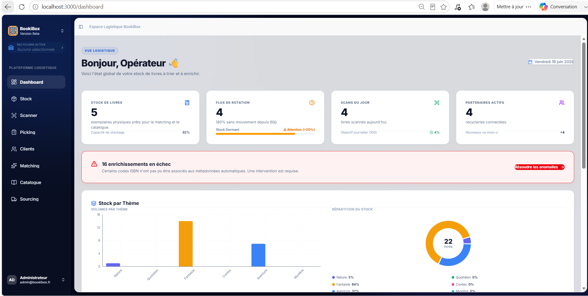

Cette page présente les principaux indicateurs :

- Nombre de livres
- Flux de rotation
- Livres scannés
- Recycleries partenaires
- Alertes d'enrichissement

---

### KPI détaillés

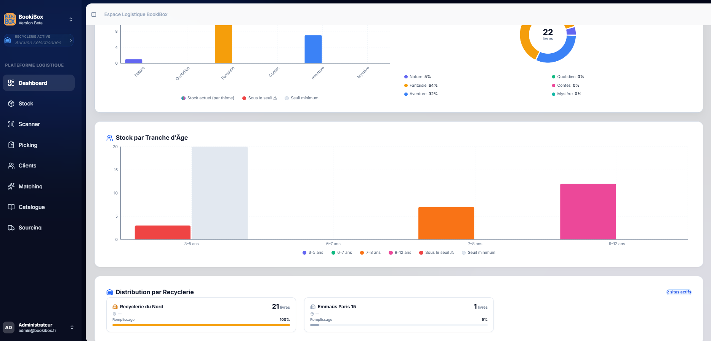

Cette vue permet de visualiser :

- Répartition par thème
- Répartition par tranche d'âge
- Distribution des livres
- Statistiques des recycleries

---

## Gestion du Stock

Le catalogue permet aux opérateurs de consulter tous les livres enregistrés.

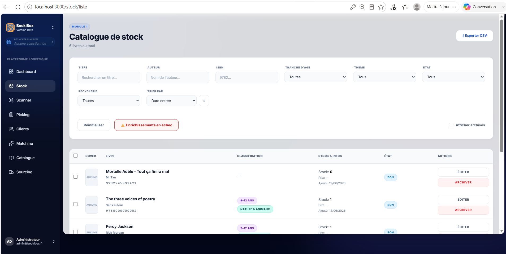

Fonctionnalités disponibles :

- Recherche multicritères
- Filtres dynamiques
- Tri
- Export CSV
- Archivage logique
---

## Gestion des Clients

Le module Clients permet l'import des bénéficiaires via un fichier Excel.


Fonctionnalités :
- Import XLSX
- Validation automatique
- Contrôle des erreurs
- Liste des bénéficiaires

---

## Module Scanner

### Écran d'accueil

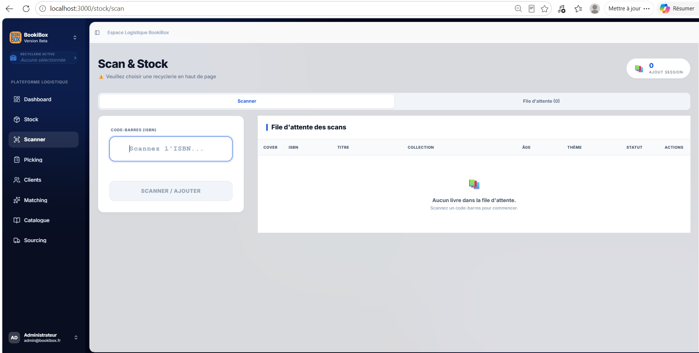

L'opérateur peut scanner un ISBN afin de récupérer automatiquement les informations du livre.

---

### Prévisualisation
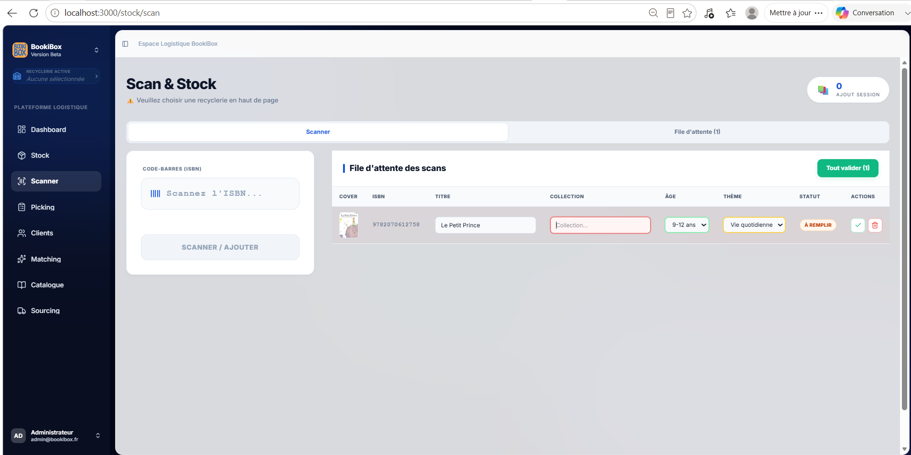

Les données récupérées sont affichées avant validation afin de permettre leur correction si nécessaire.

---

### Validation

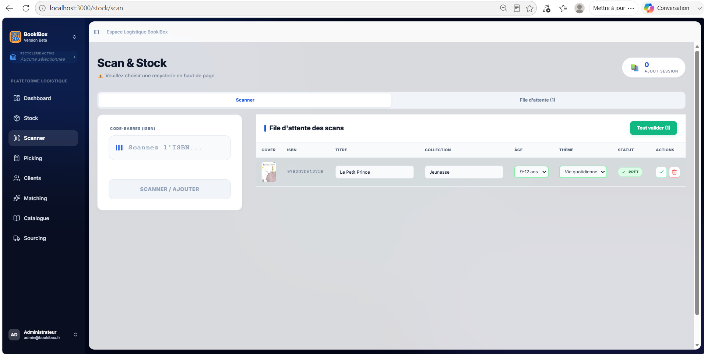

Une fois les informations complétées, le livre est prêt à être intégré dans le catalogue.

---

### Choix de la recyclerie

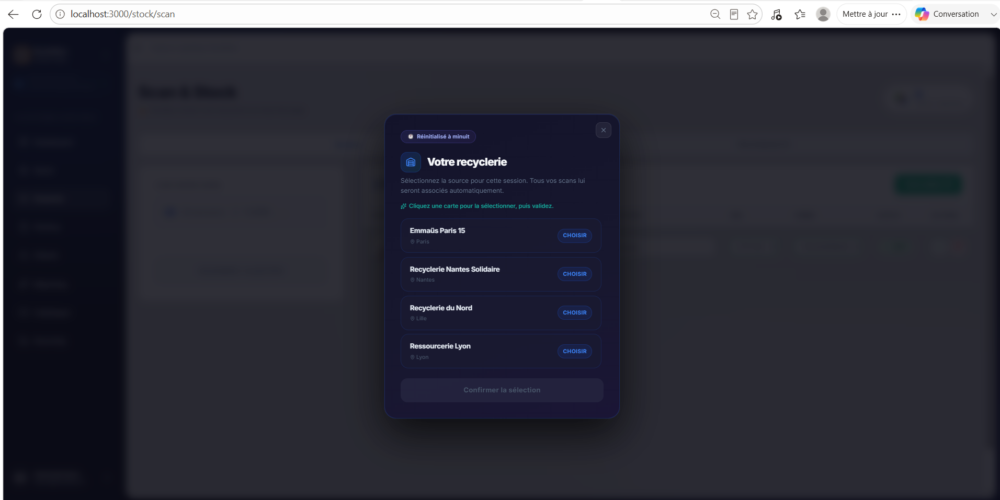

Chaque session de scan est associée à une recyclerie afin d'assurer la traçabilité des ouvrages.

---

## Module Picking

### Liste des commandes

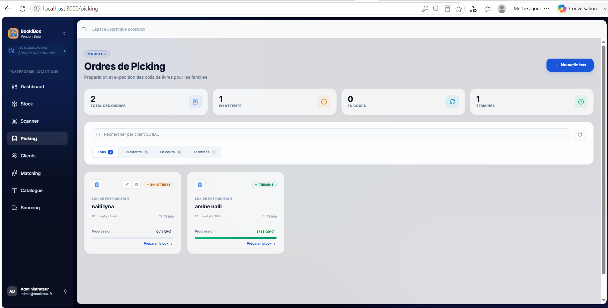

Cette interface affiche toutes les commandes de préparation avec leur état d'avancement.

---

### Préparation d'une commande

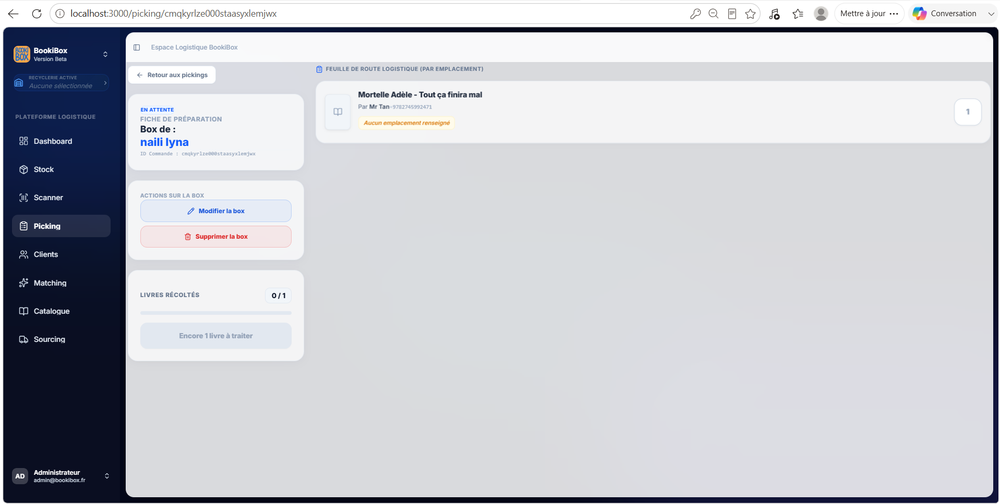

L'opérateur retrouve les livres à récupérer ainsi que leur progression.

---

### Validation

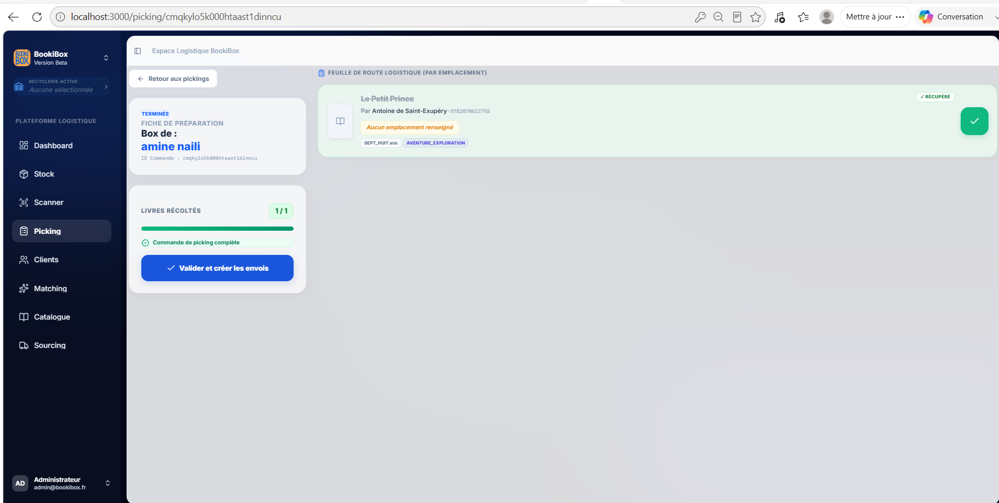

Lorsque tous les livres sont récupérés, la commande peut être validée afin de générer l'expédition.

---

### Historique des envois

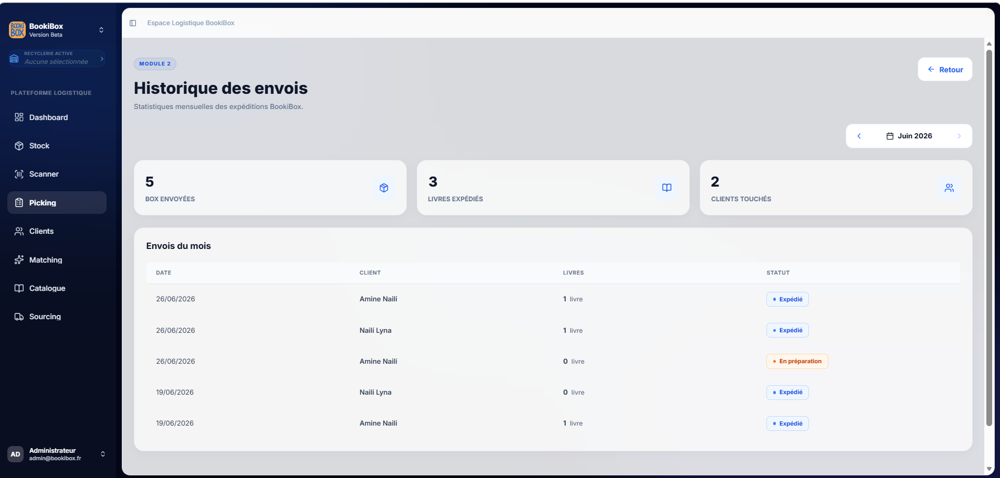

Cette page permet de consulter les statistiques mensuelles ainsi que le détail des expéditions.

---

# Développement Agile

Le projet a été développé selon la méthodologie Scrum.

Les développements étaient organisés en sprints avec un suivi quotidien sur Jira.

---

## Sprint 2 — Dashboard

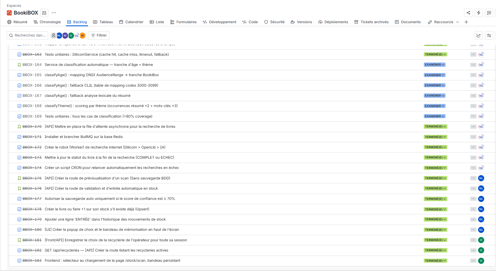

---

## Sprint 3 — Stock & Scanner

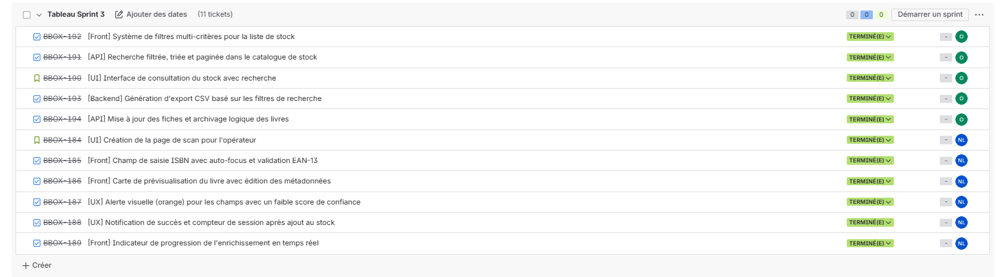

---

## Sprints 4 & 5 — Clients & Picking

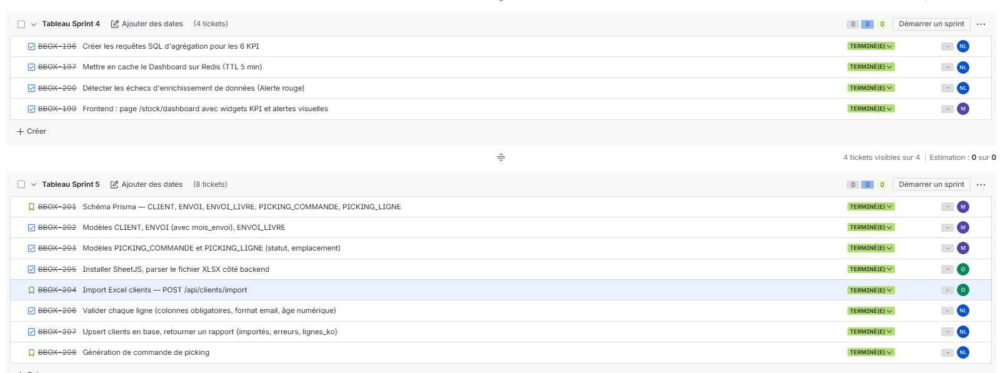

---

## Tableau Kanban Jira

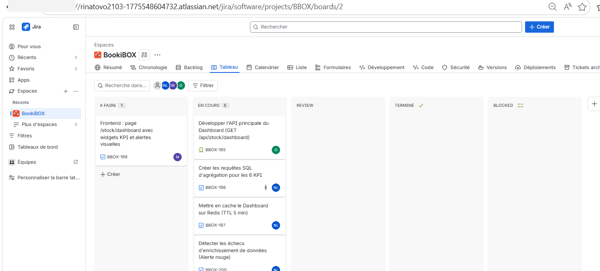

Le suivi des développements était réalisé dans Jira à travers les différentes colonnes :

- À faire
- En cours
- Review
- Terminé
- Bloqué

Cette organisation facilitait le suivi des tâches, les revues de code et la planification des sprints.

---

# Stack technique

| Frontend | Backend | Base de données | DevOps |
|-----------|----------|-----------------|---------|
| Next.js | NestJS | PostgreSQL | Git |
| React | Prisma | Redis | GitHub |
| TypeScript | REST API | BullMQ | Jira |

---

# Compétences développées

|  Développement   |  Base de données   |  Outils  |
| ---------------- | ------------------ | -------- |
| Next.js          | PostgreSQL         | Git      |
| React            | Prisma             | GitHub   |
| NestJS           | Redis              | Jira     |
| TypeScript       | SQL                | Scrum    |


---

# Conclusion

Ce stage m'a permis de contribuer au développement d'une application métier utilisée au quotidien par les équipes logistiques de BookiBox.

Au-delà des fonctionnalités développées, cette expérience m'a permis de renforcer mes compétences en développement Full Stack, de travailler sur un projet existant au sein d'une équipe Agile et de participer à la conception d'API REST ainsi qu'à l'évolution d'interfaces utilisateur répondant à des besoins métier concrets.

Le code source n'est pas publié, car il appartient à l'entreprise dans laquelle ce projet a été réalisé. Ce dépôt a pour objectif de présenter le contexte du projet, son architecture ainsi que les principales fonctionnalités sur lesquelles j'ai contribué durant mon stage.
